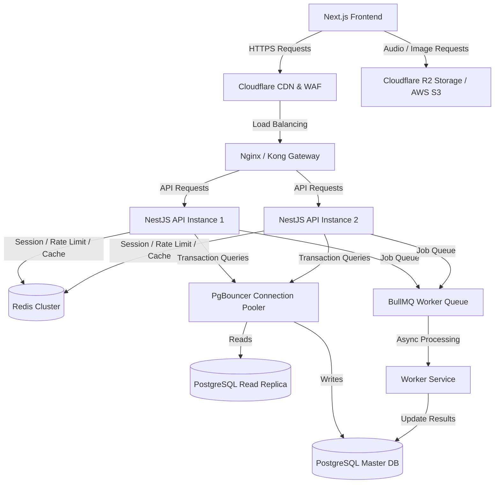

# Kế hoạch Kiến trúc Hệ thống Backend & Database — TOEIC Green

Tài liệu này trình bày chi tiết về kiến trúc Backend và thiết kế Cơ sở dữ liệu (Database) cho dự án **TOEIC Green**. Kế hoạch được thiết kế hướng tới khả năng chịu tải cao (High Concurrency), tính sẵn sàng lớn (High Availability), khả năng mở rộng lâu dài (Scalability), và đồng bộ hóa tối ưu với giao diện Frontend hiện tại.

---

## 1. Phân tích Hiện trạng Hệ thống & Thử thách kỹ thuật

### 1.1 Khảo sát Frontend & Quản lý dữ liệu hiện tại
Hiện tại, giao diện Frontend của TOEIC Green hoạt động độc lập và lưu trữ dữ liệu giả lập (Mock) trực tiếp trên Client thông qua các cơ chế:
- **Auth**: Dùng tài khoản giả lập được lưu tại `localStorage` với key `toeic-green-auth`.
- **Luyện thi (Practice)**: Sử dụng `sessionStorage` để lưu trạng thái làm bài tạm thời.
  - *Hạn chế*: Nếu người dùng vô tình đóng tab hoặc tải lại trang, toàn bộ kết quả làm bài của đề thi 200 câu sẽ bị mất sạch.
- **Sổ tay từ vựng (Vocabulary)**: Lưu trữ cục bộ qua `localStorage` (`toeic-green-vocabulary`).
- **Từ vựng khám phá (Explore)**: Trạng thái học và đánh giá từ lưu tại `localStorage` (`toeic-green-explore-progress`).
- **Phân tích tiến độ (Progress Dashboard)**: Được tính toán thời gian thực từ dữ liệu Client.

### 1.2 Các vấn đề kỹ thuật cốt lõi cần giải quyết khi lên Production
1. **Mất mát dữ liệu**: `sessionStorage` và `localStorage` không đồng bộ đám mây. Đổi thiết bị (từ PC sang điện thoại) sẽ mất toàn bộ tiến trình học.
2. **Khả năng chịu tải đồng thời**: Một bài thi TOEIC chứa 200 câu hỏi với rất nhiều nội dung audio (nghe hiểu) và hình ảnh (Part 1). Khi có **10,000+ người làm bài thi cùng lúc**, băng thông audio và kết nối database sẽ bị nghẽn nếu không có chiến lược cache và CDN phù hợp.
3. **Chấm điểm & Lưu kết quả thi**: Chấm bài 200 câu đồng thời gửi kết quả chi tiết từng câu (bao gồm đáp án đã chọn, đúng/sai, thời gian làm mỗi câu) tạo ra lượng ghi DB (Write operations) rất lớn.
4. **Bảo mật và Xác thực**: Chưa có hệ thống Token (Access Token/Refresh Token) an toàn, dễ bị bypass hoặc tấn công giả mạo điểm số.

---

## 2. Kiến trúc Hệ thống Tổng quát (High-Level Architecture)

Để đáp ứng lượng lớn người dùng đồng thời và phát triển lâu dài, hệ thống được thiết kế theo kiến trúc **Modular Monolith** (Giai đoạn đầu) và sẵn sàng tách thành **Microservices** (khi đạt quy mô lớn) kết hợp với các giải pháp bổ trợ hiệu năng cao.



### Các thành phần chính trong kiến trúc:
1. **API Gateway (Nginx / Kong)**: Chịu trách nhiệm định tuyến, SSL termination, gộp log, chặn IP xấu và giới hạn tần suất yêu cầu (Rate Limiting) ở tầng mạng.
2. **NestJS API Instances (Clustered)**: Chạy dưới dạng Docker container, scale ngang dựa trên số lượng CPU core hoặc tải lượng thực tế (Auto-scaling). Sử dụng **Fastify** thay thế cho ExpressJS mặc định để tăng hiệu năng xử lý request lên gấp đôi.
3. **Redis Cluster**: Lưu trữ dữ liệu phiên đăng nhập (Session), blacklist token, cấu hình rate limit, lưu bảng xếp hạng (Leaderboards), và làm bộ đệm cache cho các dữ liệu ít thay đổi (nội dung đề thi).
4. **PgBouncer & PostgreSQL Master-Replica**:
   - **PgBouncer**: Giúp quản lý pool kết nối PostgreSQL hiệu quả trong các kịch bản lượng truy cập tăng đột biến, tránh lỗi nghẽn cổng kết nối DB (`Too many clients`).
   - **Master-Replica**: Tách biệt luồng ghi dữ liệu (nộp bài thi, lưu từ vựng) vào máy chủ Master và luồng đọc dữ liệu (lấy danh sách đề, tải câu hỏi) ra máy chủ Replica.
5. **BullMQ / Queue Worker**: Tách biệt luồng chấm bài thi chi tiết và phân tích tiến độ học tập (CPU-heavy) ra khỏi luồng xử lý API chính, đảm bảo API luôn phản hồi nhanh dưới 100ms.
6. **Cloudflare R2 / AWS S3**: Lưu trữ toàn bộ tệp tĩnh dung lượng lớn (file nghe MP3, ảnh câu hỏi Part 1). Băng thông egress của Cloudflare R2 bằng 0 giúp tối ưu hóa chi phí truyền tải audio.

---

## 3. Lựa chọn Tech Stack & Rationale

| Layer | Công nghệ | Lý do chọn lựa chuyên nghiệp | Phương án dự phòng hiệu năng cao |
| :--- | :--- | :--- | :--- |
| **Runtime** | Node.js v20+ LTS | Đồng bộ ngôn ngữ TypeScript với Frontend, tối ưu hóa tốc độ phát triển và chia sẻ kiểu dữ liệu (DTOs). | Bun (Hiệu năng cao hơn, khởi động nhanh hơn). |
| **Framework** | **NestJS v11** | Cung cấp kiến trúc chặt chẽ (Module, Dependency Injection, Guards, Pipes). Thích hợp cho dự án quy mô lớn, dễ bảo trì, dễ viết kiểm thử tự động (Unit/E2E testing). | **Go (Golang) / Gin** (Dành cho các microservices xử lý realtime hoặc engine tính toán tải lớn). |
| **Database** | **PostgreSQL v16** | Hệ quản trị CSDL quan hệ mạnh mẽ, hỗ trợ transaction ACID, xử lý tốt các liên kết phức tạp (Users $\leftrightarrow$ Attempts $\leftrightarrow$ Answers), có kiểu JSONB linh hoạt và tối ưu hóa index tốt. | MySQL v8. |
| **ORM** | **Prisma v6** | Type-safe tuyệt đối, tự động đồng bộ Schema DB với TypeScript type, hỗ trợ Migration an toàn và trực quan. | Drizzle ORM (Hiệu năng thô nhanh hơn, viết SQL tự nhiên hơn). |
| **Cache & Realtime** | **Redis v7** | Lưu trữ in-memory cực nhanh, hỗ trợ cấu trúc dữ liệu phong phú (Sorted Sets cho bảng xếp hạng, Pub/Sub cho đồng bộ realtime). | Memcached. |
| **Message Queue** | **BullMQ (Redis-based)** | Tích hợp sâu với Redis, quản lý hàng đợi công việc (Job Queue) mạnh mẽ, có cơ chế retry tự động khi gặp lỗi hệ thống. | RabbitMQ / Apache Kafka (Khi mở rộng quy mô lớn cần stream dữ liệu). |
| **File Storage** | **Cloudflare R2** | Tương thích S3 API, đặc biệt là **miễn phí phí tải xuống (Egress fees)**. Điều này cực kỳ quan trọng đối với web TOEIC vì người dùng sẽ nghe đi nghe lại các file audio nghe hiểu dung lượng lớn. | AWS S3 + CloudFront. |

---

## 4. Thiết kế Database Schema tối ưu hóa cho tải lớn

Để hệ thống hoạt động ổn định khi lượng dữ liệu phình to (ví dụ: 100k người dùng làm 50 đề thi $\rightarrow$ 1 tỷ bản ghi câu trả lời), chúng tôi thiết kế Database Schema chia nhỏ theo phân hệ và áp dụng kỹ thuật **Partitioning** (phân vùng dữ liệu).

### 4.1 Thực thể và mối quan hệ (ERD)

```sql
-- Kích hoạt extension hỗ trợ sinh UUID tự động
CREATE EXTENSION IF NOT EXISTS "uuid-ossp";

-- 1. BẢNG USER & AUTH
CREATE TABLE "users" (
    "id" UUID PRIMARY KEY DEFAULT uuid_generate_v4(),
    "email" VARCHAR(255) UNIQUE NOT NULL,
    "password_hash" VARCHAR(255), -- NULL nếu chỉ dùng Social Login
    "display_name" VARCHAR(100) NOT NULL,
    "avatar_url" TEXT,
    "role" VARCHAR(20) DEFAULT 'USER', -- 'USER', 'ADMIN', 'MODERATOR'
    "status" VARCHAR(20) DEFAULT 'ACTIVE', -- 'ACTIVE', 'BANNED', 'PENDING'
    "created_at" TIMESTAMP WITH TIME ZONE DEFAULT NOW(),
    "updated_at" TIMESTAMP WITH TIME ZONE DEFAULT NOW()
);

CREATE TABLE "oauth_accounts" (
    "id" BIGSERIAL PRIMARY KEY,
    "user_id" UUID NOT NULL REFERENCES "users"("id") ON DELETE CASCADE,
    "provider" VARCHAR(50) NOT NULL, -- 'GOOGLE', 'GITHUB', 'FACEBOOK'
    "provider_user_id" VARCHAR(255) NOT NULL,
    "created_at" TIMESTAMP WITH TIME ZONE DEFAULT NOW(),
    UNIQUE("provider", "provider_user_id")
);

CREATE TABLE "user_profiles" (
    "user_id" UUID PRIMARY KEY REFERENCES "users"("id") ON DELETE CASCADE, -- Sử dụng luôn user_id làm khóa chính (quan hệ 1-1)
    "target_score" INTEGER DEFAULT 450,
    "current_level" VARCHAR(50) DEFAULT 'BEGINNER',
    "bio" TEXT,
    "banner_tone" VARCHAR(50) DEFAULT 'mint',
    "study_hours_per_week" INTEGER DEFAULT 5,
    "updated_at" TIMESTAMP WITH TIME ZONE DEFAULT NOW()
);

-- 2. BẢNG ĐỀ THI & CÂU HỎI (TESTS & QUESTIONS)
CREATE TABLE "tests" (
    "id" SERIAL PRIMARY KEY, -- Sử dụng INT tự tăng vì số lượng đề thi rất nhỏ
    "slug" VARCHAR(255) UNIQUE NOT NULL, -- Dùng cho URL hiển thị
    "title" VARCHAR(255) NOT NULL,
    "subtitle" VARCHAR(255),
    "type" VARCHAR(100) NOT NULL, -- 'Listening & Reading' hoặc 'Speaking & Writing'
    "short_type" VARCHAR(50) NOT NULL, -- 'L & R', 'Speaking', 'Writing'
    "duration_minutes" INTEGER NOT NULL DEFAULT 120,
    "total_questions" INTEGER NOT NULL DEFAULT 200,
    "access_level" VARCHAR(20) DEFAULT 'FREE', -- 'FREE', 'PREMIUM'
    "is_published" BOOLEAN DEFAULT FALSE,
    "created_at" TIMESTAMP WITH TIME ZONE DEFAULT NOW(),
    "updated_at" TIMESTAMP WITH TIME ZONE DEFAULT NOW()
);

CREATE TABLE "test_parts" (
    "id" SERIAL PRIMARY KEY, -- INT tự tăng
    "test_id" INTEGER NOT NULL REFERENCES "tests"("id") ON DELETE CASCADE,
    "part_number" INTEGER NOT NULL, -- 1 đến 7
    "section" VARCHAR(50) NOT NULL, -- 'LISTENING', 'READING'
    "label" VARCHAR(50) NOT NULL, -- 'Part 1'
    "description" VARCHAR(255) NOT NULL, -- 'Photographs'
    "question_count" INTEGER NOT NULL,
    UNIQUE("test_id", "part_number")
);

-- Nhóm câu hỏi (Dùng cho Part 3, 4, 6, 7 - nhiều câu hỏi chung 1 audio/passage)
CREATE TABLE "question_groups" (
    "id" BIGSERIAL PRIMARY KEY, -- BIGINT tự tăng
    "test_part_id" INTEGER NOT NULL REFERENCES "test_parts"("id") ON DELETE CASCADE,
    "passage" TEXT, -- Đoạn văn đọc hiểu
    "audio_url" TEXT, -- Đường dẫn file nghe của cả nhóm câu hỏi
    "image_url" TEXT, -- Hình ảnh chung (nếu có)
    "transcript" TEXT, -- Lời thoại audio
    "sort_order" INTEGER DEFAULT 0
);

CREATE TABLE "questions" (
    "id" BIGSERIAL PRIMARY KEY, -- BIGINT tự tăng giúp JOIN cực kỳ nhanh
    "test_part_id" INTEGER NOT NULL REFERENCES "test_parts"("id") ON DELETE CASCADE,
    "group_id" BIGINT REFERENCES "question_groups"("id") ON DELETE SET NULL,
    "question_number" INTEGER NOT NULL, -- Số thứ tự câu hỏi trong đề (1-200)
    "stem" TEXT NOT NULL, -- Đề bài / Câu hỏi
    "option_a" TEXT NOT NULL,
    "option_b" TEXT NOT NULL,
    "option_c" TEXT NOT NULL,
    "option_d" TEXT, -- Part 2 chỉ có 3 lựa chọn (A, B, C)
    "correct_answer" CHAR(1) NOT NULL, -- 'A', 'B', 'C', 'D'
    "explanation" TEXT, -- Giải thích đáp án
    "image_url" TEXT, -- Ảnh riêng của câu hỏi (nếu có)
    "audio_url" TEXT, -- Audio riêng (nếu có)
    "difficulty" VARCHAR(20) DEFAULT 'MEDIUM', -- 'EASY', 'MEDIUM', 'HARD'
    "created_at" TIMESTAMP WITH TIME ZONE DEFAULT NOW(),
    UNIQUE("test_part_id", "question_number")
);

-- 3. BẢNG TIẾN TRÌNH LÀM BÀI (PRACTICE ATTEMPTS)
CREATE TABLE "practice_attempts" (
    "id" BIGSERIAL PRIMARY KEY, -- BIGINT làm khóa chính vật lý để JOIN nhanh
    "public_id" UUID UNIQUE NOT NULL DEFAULT uuid_generate_v4(), -- UUID ngẫu nhiên để an toàn khi hiển thị trên URL
    "user_id" UUID NOT NULL REFERENCES "users"("id") ON DELETE CASCADE,
    "test_id" INTEGER NOT NULL REFERENCES "tests"("id") ON DELETE CASCADE,
    "mode" VARCHAR(50) NOT NULL, -- 'PRACTICE', 'FULL_TEST'
    "status" VARCHAR(50) DEFAULT 'IN_PROGRESS', -- 'IN_PROGRESS', 'COMPLETED', 'ABANDONED'
    "correct_count" INTEGER DEFAULT 0,
    "total_count" INTEGER DEFAULT 0,
    "scaled_score" INTEGER, -- Điểm TOEIC quy đổi (10-990)
    "duration_seconds" INTEGER DEFAULT 0,
    "started_at" TIMESTAMP WITH TIME ZONE DEFAULT NOW(),
    "completed_at" TIMESTAMP WITH TIME ZONE
);

-- Chi tiết từng câu trả lời của user. Loại bỏ hoàn toàn cột ID riêng biệt.
CREATE TABLE "attempt_answers" (
    "attempt_id" BIGINT NOT NULL REFERENCES "practice_attempts"("id") ON DELETE CASCADE,
    "question_id" BIGINT NOT NULL REFERENCES "questions"("id") ON DELETE CASCADE,
    "selected_answer" CHAR(1), -- NULL nếu bỏ trống
    "is_correct" BOOLEAN DEFAULT FALSE,
    "is_flagged" BOOLEAN DEFAULT FALSE,
    "time_spent_ms" INTEGER DEFAULT 0,
    "answered_at" TIMESTAMP WITH TIME ZONE DEFAULT NOW(),
    PRIMARY KEY ("attempt_id", "question_id") -- Khóa chính Composite ngăn trùng lặp và cực kỳ tiết kiệm bộ nhớ index
);

-- 4. BẢNG SỔ TAY TỪ VỰNG & KHÁM PHÁ (VOCABULARY & EXPLORE)
CREATE TABLE "user_vocabularies" (
    "id" BIGSERIAL PRIMARY KEY,
    "user_id" UUID NOT NULL REFERENCES "users"("id") ON DELETE CASCADE,
    "word" VARCHAR(100) NOT NULL,
    "phonetic" VARCHAR(100),
    "part_of_speech" VARCHAR(50),
    "meaning" TEXT NOT NULL,
    "example" TEXT,
    "example_translation" TEXT,
    "status" VARCHAR(50) DEFAULT 'LEARNING', -- 'LEARNING', 'MASTERED'
    "is_favorite" BOOLEAN DEFAULT FALSE,
    "note" TEXT,
    "last_reviewed_at" TIMESTAMP WITH TIME ZONE,
    "created_at" TIMESTAMP WITH TIME ZONE DEFAULT NOW(),
    UNIQUE("user_id", "word")
);

CREATE TABLE "explore_collections" (
    "id" SERIAL PRIMARY KEY,
    "slug" VARCHAR(255) UNIQUE NOT NULL,
    "title" VARCHAR(255) NOT NULL,
    "description" TEXT,
    "category" VARCHAR(100),
    "level" VARCHAR(50),
    "word_count" INTEGER DEFAULT 0,
    "is_published" BOOLEAN DEFAULT TRUE,
    "sort_order" INTEGER DEFAULT 0
);

CREATE TABLE "explore_words" (
    "id" BIGSERIAL PRIMARY KEY,
    "collection_id" INTEGER NOT NULL REFERENCES "explore_collections"("id") ON DELETE CASCADE,
    "word" VARCHAR(100) NOT NULL,
    "phonetic" VARCHAR(100),
    "part_of_speech" VARCHAR(50),
    "meaning" TEXT NOT NULL,
    "example" TEXT,
    "example_translation" TEXT,
    "image_url" TEXT,
    "audio_url" TEXT
);

CREATE TABLE "explore_progress" (
    "user_id" UUID NOT NULL REFERENCES "users"("id") ON DELETE CASCADE,
    "collection_id" INTEGER NOT NULL REFERENCES "explore_collections"("id") ON DELETE CASCADE,
    "is_saved" BOOLEAN DEFAULT FALSE,
    "is_studying" BOOLEAN DEFAULT FALSE,
    "last_studied_at" TIMESTAMP WITH TIME ZONE DEFAULT NOW(),
    PRIMARY KEY ("user_id", "collection_id") -- Khóa chính Composite
);

CREATE TABLE "word_ratings" (
    "user_id" UUID NOT NULL REFERENCES "users"("id") ON DELETE CASCADE,
    "explore_word_id" BIGINT NOT NULL REFERENCES "explore_words"("id") ON DELETE CASCADE,
    "rating" VARCHAR(20) NOT NULL, -- 'EASY', 'MEDIUM', 'HARD', 'KNOWN'
    "created_at" TIMESTAMP WITH TIME ZONE DEFAULT NOW(),
    PRIMARY KEY ("user_id", "explore_word_id") -- Khóa chính Composite
);
```

### 4.2 Các chiến lược tối ưu hóa database cho quy mô lớn
- **Partitioning bảng `attempt_answers`**: Khi số lượt thi tăng cao, bảng này sẽ nhanh chóng đạt hàng chục triệu bản ghi. Chúng tôi phân vùng (partition) bảng này theo hash của `attempt_id` hoặc theo thời gian thực hiện (`answered_at`) để giữ kích thước các file index nhỏ, đảm bảo tốc độ ghi/đọc không bị suy giảm theo thời gian.
- **Tận dụng Index thông minh**:
  - `idx_questions_group_id`: Truy vấn nhanh các câu hỏi thuộc nhóm passage/audio.
  - `idx_attempts_user_id_completed_at`: Tải nhanh lịch sử làm bài thi của một user cụ thể, sắp xếp theo thời gian mới nhất.
  - `idx_vocab_user_id_status`: Hỗ trợ truy vấn bộ từ đang học hoặc đã thuộc của user.
- **Cơ chế nén JSONB**: Đối với dữ liệu phức tạp ít truy vấn cấu trúc (ví dụ: metadata phụ của đề thi, hoặc dữ liệu log chi tiết hành vi click chuột khi thi), lưu trữ dưới dạng cột `JSONB` trong PostgreSQL giúp schema gọn gàng và tránh tạo quá nhiều bảng liên kết thừa.

---

## 5. Chiến lược xử lý Đồng thời & Hiệu năng cao (Concurrency & Performance)

Để hệ thống hoạt động mượt mà khi lượng truy cập lớn (đáp ứng >5,000 requests/giây), chúng tôi đề xuất các giải pháp chuyên nghiệp sau:

### 5.1 Kiến trúc Caching nhiều lớp (Multi-level Caching)
1. **Application Memory Cache (In-Memory)**: Sử dụng cache trong bộ nhớ của NestJS instance cho các thông tin cực kỳ phổ biến và siêu nhẹ như danh sách các Part, nhãn hiển thị hoặc thông tin cấu hình hệ thống. (TTL: 5-10 phút).
2. **Distributed Cache (Redis)**:
   - **Đề thi và Câu hỏi**: Khi người dùng mở trang luyện thi, hệ thống sẽ đọc toàn bộ cấu trúc đề thi và câu hỏi từ Redis thay vì truy vấn PostgreSQL. Dữ liệu này chỉ được cập nhật lại khi Admin sửa đề thi (sử dụng cơ chế Cache-Aside).
   - **Xác thực**: Lưu trữ các Refresh Token và Session hoạt động của người dùng để kiểm tra quyền truy cập tức thì mà không cần quét bảng `users` trong DB ở mỗi request.
3. **HTTP / CDN Cache (Cloudflare)**:
   - Các asset tĩnh như file MP3 và hình ảnh đề thi được cache trực tiếp tại các Edge Server của Cloudflare gần vị trí của người dùng nhất, giảm tải hoàn toàn băng thông cho server API.

### 5.2 Xử lý Bất đồng bộ qua Hàng đợi (Message Queue Offloading)
Khi người dùng bấm "Nộp bài", nếu hệ thống xử lý tính điểm, phân tích phần trăm đúng/sai của từng Part, lưu lại 200 câu trả lời vào database và tính toán dự báo điểm số TOEIC tương lai một cách đồng bộ trong luồng API chính, luồng này sẽ bị nghẽn (Blocking). 

**Giải pháp**:
1. API ghi nhận thông tin nộp bài tạm thời, gửi một Job dạng `{ userId, attemptId, answers }` vào **BullMQ**.
2. Phản hồi lập tức cho Client mã HTTP `202 Accepted` kèm theo trạng thái "Đang xử lý".
3. **Queue Worker** lấy job ra khỏi hàng đợi để xử lý chấm điểm độc lập ở tiến trình nền (background process).
4. Sau khi hoàn thành, hệ thống cập nhật kết quả vào DB và gửi tín hiệu realtime (WebSockets) hoặc thông báo qua Server-Sent Events (SSE) để Client hiển thị kết quả làm bài.

```
Client (Nộp bài) ───► API Server ───► Gửi Job vào BullMQ ───► Trả về HTTP 202 (Done)
                                                                    │
   WebSocket báo điểm ◄─── API Server ◄─── Cập nhật DB ◄─── Worker xử lý chấm điểm (Background)
```

### 5.3 Connection Pooling chuyên nghiệp với PgBouncer
Trong môi trường Node.js (non-blocking I/O), hàng nghìn truy vấn đồng thời có thể được gửi đi. Tuy nhiên PostgreSQL sử dụng kiến trúc tiến trình (process-based), mỗi kết nối mới chiếm khoảng 10MB RAM và tài nguyên CPU đáng kể. 

Chúng tôi sử dụng **PgBouncer** chạy ở chế độ **Transaction Mode**:
- Cho phép hàng nghìn NestJS connection ảo kết nối tới PgBouncer.
- PgBouncer gom chúng lại và thực thi qua một pool nhỏ khoảng 50 kết nối thực tới PostgreSQL DB.
- Tiết kiệm bộ nhớ RAM trên máy chủ PostgreSQL, duy trì hiệu năng DB ổn định ở mức tải tối đa.

---

## 6. Authentication & Security (Xác thực & Bảo mật nâng cao)

Để ngăn chặn gian lận điểm số, mất cắp tài khoản và các cuộc tấn công DDoS:

1. **Cơ chế Token Kép (Double Token Strategy)**:
   - **Access Token (JWT)**: Thời hạn ngắn (15-30 phút), lưu hoàn toàn trong bộ nhớ RAM của Client (Memory), truyền qua header `Authorization: Bearer`.
   - **Refresh Token**: Thời hạn dài (7-30 ngày), được ký số và lưu trong Cookie của trình duyệt với các cờ bảo mật bắt buộc: `HttpOnly`, `Secure`, `SameSite=Strict`. Tránh hoàn toàn tấn công XSS (Cross-Site Scripting).
2. **Quản lý Token Revocation qua Redis**:
   - Khi người dùng bấm đăng xuất hoặc đổi mật khẩu, Refresh Token cũ sẽ bị đưa vào danh sách đen (Blacklist) trên Redis với thời hạn hết hạn bằng thời hạn còn lại của token đó, vô hiệu hóa ngay lập tức các phiên truy cập cũ.
3. **Rate Limiting thông minh**:
   - Sử dụng Redis để đếm và chặn các địa chỉ IP có dấu hiệu spam API.
   - Giới hạn chung: 100 requests/phút cho các API thông thường.
   - Giới hạn khắt khe: 5 requests/phút cho các API nhạy cảm như Đăng nhập, Quên mật khẩu, Nộp bài thi.
4. **Mã hóa Dữ liệu Nhạy cảm**:
   - Mật khẩu người dùng được băm bằng thuật toán **bcrypt** (độ phức tạp/Salt Rounds = 12).
   - Mã khóa kết nối hoặc Token OAuth từ Google/Github được mã hóa bằng thuật toán đối xứng **AES-256-GCM** trước khi lưu trữ vào cơ sở dữ liệu.

---

## 7. Quy trình Tích hợp và Đồng bộ hóa Dữ liệu Crawl (Seed Data Pipeline)

Hiện tại dự án đã crawl thành công **10 đề thi TOEIC thực tế** (hơn 2,000 câu hỏi chất lượng) từ Study4. Dữ liệu này cần được đưa vào PostgreSQL một cách khoa học để ứng dụng có thể gọi API tải đề thi động.

### 7.1 Cấu trúc thư mục dữ liệu Crawl hiện có
Dữ liệu crawl nằm trong thư mục `toeic-crawler/output/`, chia thành các thư mục con tương ứng với từng đề thi, chứa file mô tả `test_info.json` và cấu trúc các phần:
```
toeic-crawler/output/
├── tests_index.json
└── new-economy-toeic-test-1/
    ├── test_info.json
    ├── listening/
    │   ├── part1.json
    │   ├── part2.json
    │   ├── part3.json
    │   └── part4.json
    └── reading/
        ├── part5.json
        ├── part6.json
        └── part7.json
```

### 7.2 Quy trình Import tự động (Prisma Seed Script)
Chúng tôi sẽ viết một script seeding `prisma/seed.ts` để đọc và phân tích cấu trúc dữ liệu JSON thô, sau đó ghi trực tiếp vào PostgreSQL theo đúng mối quan hệ khóa ngoại:

1. **Bước 1: Khởi tạo dữ liệu Đề thi (Test)**: Đọc file `test_info.json` để tạo mới bản ghi trong bảng `tests`.
2. **Bước 2: Tạo các Part (TestPart)**: Tạo các bản ghi phần thi từ Part 1 đến Part 7 tương ứng với đề thi vừa tạo.
3. **Bước 3: Nhóm câu hỏi (QuestionGroup)**:
   - Với Part 1, 2, 5: Tạo trực tiếp câu hỏi (`questions`).
   - Với Part 3, 4, 6, 7 (Dạng nhóm câu hỏi): Tạo bản ghi trong bảng `question_groups` để lưu trữ file Audio dùng chung hoặc đoạn văn (Passage) dùng chung, sau đó tạo các câu hỏi thuộc nhóm này trỏ khóa ngoại về nhóm đó.
4. **Bước 4: Upload Asset tĩnh lên Cloudflare R2**:
   - Quét qua toàn bộ file ảnh và file audio nghe của câu hỏi.
   - Đẩy chúng lên R2 Bucket qua SDK và cập nhật lại đường dẫn URL R2 trong Database thay vì dùng link crawl trực tiếp từ Study4 (tránh lỗi Hotlinking hoặc link gốc bị xóa).

---

## 8. Lộ trình Triển khai Dự án Backend (Roadmap)

Kế hoạch phát triển được chia làm 4 giai đoạn rõ ràng trong khoảng **6-8 tuần**:

```
 Giai đoạn 1: Foundation (Tuần 1-2)  ──► Setup NestJS, Docker Compose, Database Schema & Authentication
 Giai đoạn 2: Core Features (Tuần 3-4) ──► Seed Dữ liệu đề thi, API Luyện thi, API Chấm điểm & Lưu kết quả
 Giai đoạn 3: User Space (Tuần 5)     ──► CRUD Từ vựng cá nhân, Đồng bộ Explore, Phân tích Tiến độ học tập
 Giai đoạn 4: Production Ready (Tuần 6) ──► Cache Redis, Rate Limit, E2E Test, CI/CD & Cloud Deployment
```

### Chi tiết các giai đoạn:

#### Giai đoạn 1: Foundation (Nền móng) - *Thời gian: 1-2 tuần*
- Thiết lập dự án NestJS, cài đặt các thư viện lõi, cấu hình ESLint/Prettier.
- Viết file `docker-compose.yml` chạy PostgreSQL 16 và Redis 7 phục vụ môi trường nội bộ.
- Xây dựng Prisma Schema cho phân hệ Người dùng (Users, Profiles, OAuth, Refresh Tokens).
- Phát triển hệ thống đăng ký, đăng nhập bằng mật khẩu và tích hợp Google/GitHub OAuth.

#### Giai đoạn 2: Core Features (Tính năng lõi) - *Thời gian: 2 tuần*
- Thiết lập Schema chi tiết cho Đề thi (Tests, Parts, Question Groups, Questions).
- Hoàn thiện seed script import thành công 10 đề thi đã crawl vào DB.
- Phát triển API danh sách đề thi, chi tiết đề thi và bộ API lấy câu hỏi không chứa đáp án (để tránh người dùng F12 lấy đáp án trước khi thi).
- Xây dựng phân hệ Lượt làm bài (`practice_attempts`) và chấm điểm bất đồng bộ.

#### Giai đoạn 3: User Space & Data Sync (Không gian cá nhân) - *Thời gian: 1 tuần*
- Phát triển API CRUD Sổ tay từ vựng cá nhân.
- API Khám phá từ vựng (Explore collections, Word ratings).
- Viết API tổng hợp tiến độ học tập (Streak, Điểm trung bình từng phần, Biểu đồ tiến độ) hiển thị trên Progress Dashboard.
- Hỗ trợ API chuyển đổi dữ liệu từ LocalStorage của client lên Server khi người dùng đăng nhập lần đầu.

#### Giai đoạn 4: Production Ready (Vận hành & Phát hành) - *Thời gian: 1-2 tuần*
- Cấu hình Redis Cache cho các API đọc đề thi và câu hỏi.
- Thiết lập Rate Limiting và Global Exception Filter bảo mật.
- Viết tài liệu API tự động qua Swagger OpenAPI tại đường dẫn `/api/docs`.
- Thiết lập Dockerfile, viết Github Actions CI/CD để tự động build và deploy lên máy chủ cloud (VPS hoặc Managed Server).

---

## 9. Các quyết định kiến trúc cần thống nhất

Để hiện thực hóa kế hoạch này một cách tối ưu nhất, chúng tôi đề xuất thảo luận về các điểm sau:

1. **Lựa chọn Hosting Cơ sở dữ liệu**:
   - *Khuyên dùng*: Sử dụng dịch vụ cơ sở dữ liệu được quản lý (Managed Database) như **Supabase** hoặc **Neon PostgreSQL** (gói trả phí thấp lúc đầu, tự động scale sau). Tránh tự cài đặt PostgreSQL trên VPS vì việc cấu hình backup tự động và đảm bảo tính sẵn sàng cao (High Availability) của DB rất phức tạp và rủi ro.
2. **Kế hoạch lưu trữ Asset Tĩnh**:
   - Sử dụng **Cloudflare R2** là lựa chọn kinh tế nhất hiện tại vì không tốn phí băng thông tải về (egress).
3. **Bản quyền Dữ liệu Đề thi**:
   - Dữ liệu crawl hiện tại dùng cho việc kiểm thử và xây dựng sản phẩm mẫu. Khi đưa vào hoạt động kinh doanh chính thức, cần có lộ trình mua đề thi có bản quyền hoặc tự biên soạn để tránh các vấn đề pháp lý.

---

## 10. Chiến lược Triển khai 0đ (Zero-Cost Hosting Stack)

Để phù hợp với **ngân sách tối giản** (chỉ đầu tư mua tên miền), chúng ta hoàn toàn có thể triển khai kiến trúc chuyên nghiệp này **miễn phí 100%** bằng cách kết hợp các gói miễn phí (Free Tier) từ các nhà cung cấp dịch vụ Cloud hàng đầu dưới đây. 

Kiến trúc này vẫn đảm bảo tính độc lập, chuyên nghiệp và có thể chuyển đổi sang gói trả phí (Scale-up) chỉ bằng 1 cú click chuột mà không cần sửa code.

| Thành phần | Nhà cung cấp | Giới hạn gói Free (Free Tier) | Cách hoạt động & Giải pháp tối ưu |
| :--- | :--- | :--- | :--- |
| **Cơ sở dữ liệu (PostgreSQL)** | **Supabase** hoặc **Neon.tech** | - **Supabase**: 500MB lưu trữ, 50k active users/tháng.<br>- **Neon.tech**: 0.5 GiB lưu trữ, tự động ngủ đông khi không hoạt động. | 500MB là quá đủ để lưu trữ 10-20 đề thi TOEIC (khoảng 4,000 câu hỏi) và dữ liệu tiến độ của **hơn 10,000 người dùng**. Supabase hỗ trợ sẵn connection pooler. |
| **API Server (NestJS)** | **Hugging Face Spaces (Docker)** hoặc **Koyeb** | - **Hugging Face**: Docker container chạy **24/7 không ngủ đông** (Free CPU basic).<br>- **Koyeb**: 512MB RAM, 0.1 vCPU. | - Triển khai NestJS thông qua Dockerfile trên Hugging Face Spaces để hệ thống hoạt động liên tục 24/7.<br>- Koyeb hoặc **Render** cũng là lựa chọn thay thế (Render sẽ ngủ đông sau 15 phút không có request). |
| **Cache & Queue (Redis)** | **Upstash** | 10,000 requests/ngày. | Đủ dùng cho giai đoạn đầu để quản lý session đăng nhập, lưu blacklist token và chạy BullMQ cho các tác vụ chấm thi nền. |
| **Lưu trữ Audio/Ảnh** | **Cloudflare R2** hoặc **Supabase Storage** | - **Cloudflare R2**: 10GB lưu trữ miễn phí, **miễn phí băng thông tải về (0đ Egress)**.<br>- **Supabase Storage**: 1GB lưu trữ miễn phí. | Cloudflare R2 là lựa chọn tuyệt vời nhất vì TOEIC listening có hàng trăm file audio chất lượng cao. Việc Cloudflare không tính phí băng thông tải về sẽ giúp bạn tiết kiệm hàng triệu đồng khi web có nhiều lượt làm bài nghe. |
| **DNS, SSL & Bảo mật** | **Cloudflare** | SSL trọn đời, CDN miễn phí, chống DDoS cơ bản. | Quản lý tên miền bạn đã mua thông qua DNS Cloudflare để bật HTTPS miễn phí và bật cache dữ liệu tĩnh tại các server biên (Edge cache), giảm tải tối đa cho NestJS API server. |

### Cách thức hoạt động phối hợp để tối ưu tải lượng:
1. **Frontend (Next.js)**: Host trên **Vercel** (miễn phí hoàn toàn cho dự án cá nhân/phi thương mại).
2. **CDN Cloudflare**: Cấu hình CDN cache toàn bộ các file tĩnh (audio, image, các file js/css) ngay tại máy chủ biên của Cloudflare. Khi người dùng tải đề thi nghe, file audio sẽ chạy trực tiếp từ Cloudflare CDN/R2 chứ không chạm vào API Server, giúp tiết kiệm băng thông và RAM của server.
3. **Database**: Nhờ Prisma ORM, khi bạn muốn chuyển từ Supabase miễn phí sang một máy chủ PostgreSQL trả phí riêng, bạn chỉ cần thay đổi duy nhất dòng biến môi trường `DATABASE_URL` trong file `.env` mà không cần sửa đổi bất kỳ dòng code nào.

